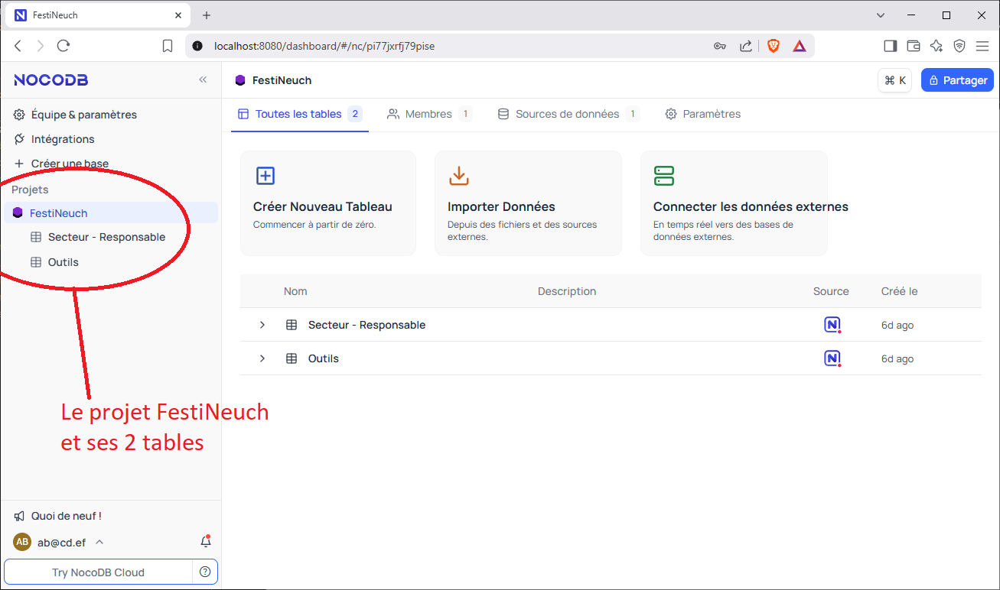

# Ouvrir la base de donnée FestiMagaz
Pour ouvrir la base de donnée de FestiMagaz, double cliquer sur l’icône “start magasin.bat” sur le bureau.  
  

La fenêtre ci-dessous va s'ouvrir. C'est le **serveur** de la base de donnée. Il n'y a rien besoin de faire, il suffit de l'ignorer et de NE PAS la fermer.  
  

Après quelque secondes (ou minutes), une deuxième fenêtre s'ouvre. On voit le projet **FestiNeuch** avec ses 2 tables:  
- Secteur - Responsable  
- Outils  
  
Ces trois lignes sont entourées en rouge dans l'image ci-dessous. Si vous ne les voyez pas, consulter le chapitre **"En cas de problème"** de cette documentation.
  