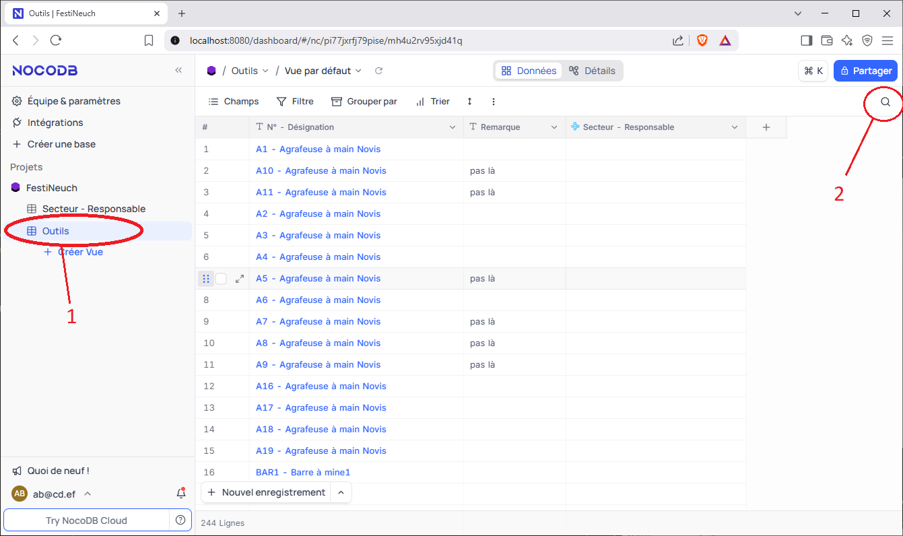
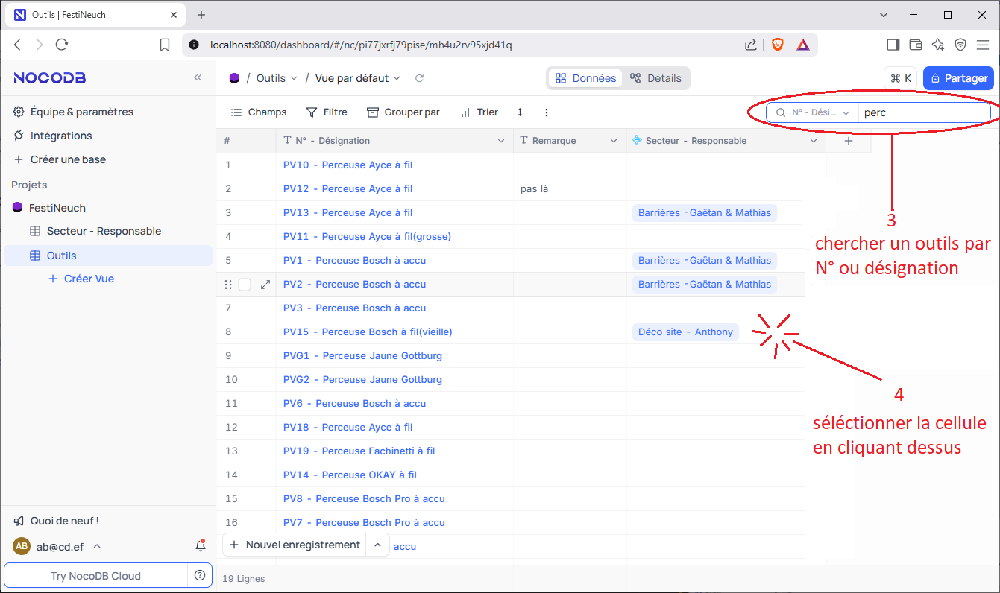
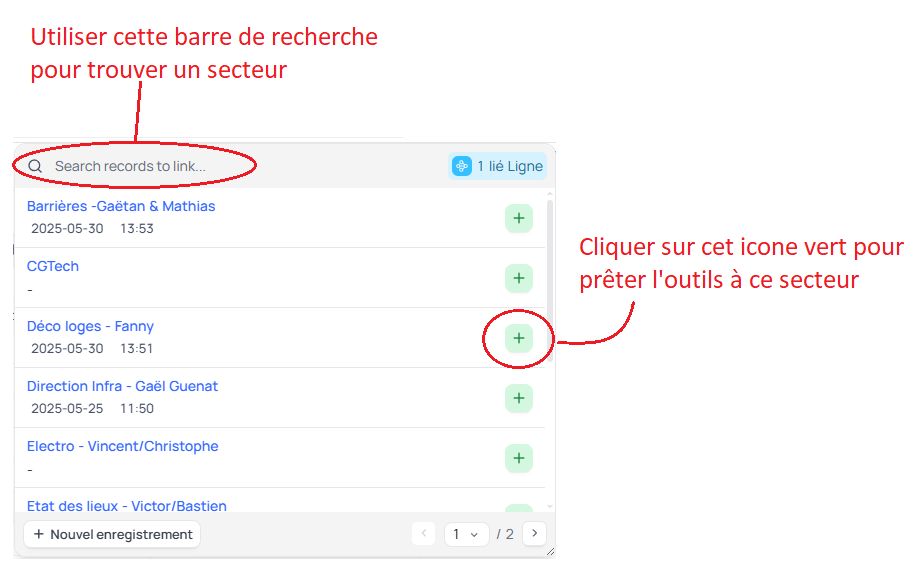
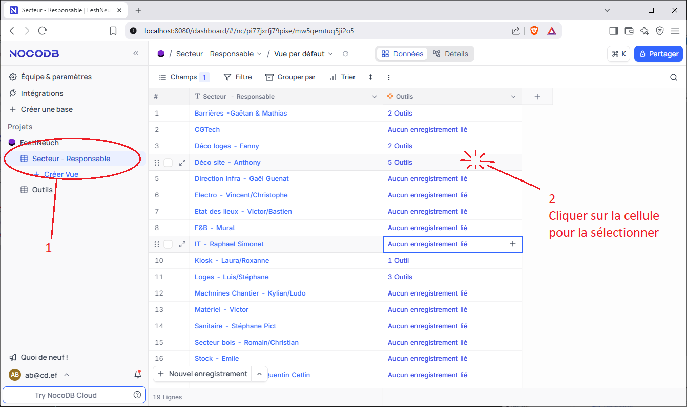
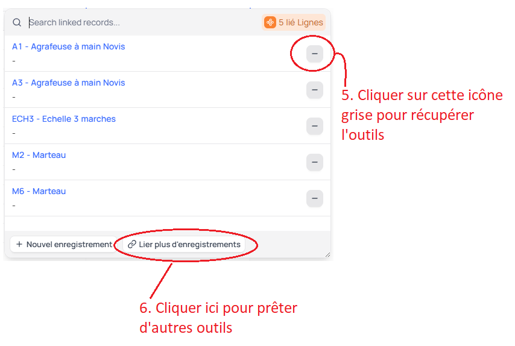
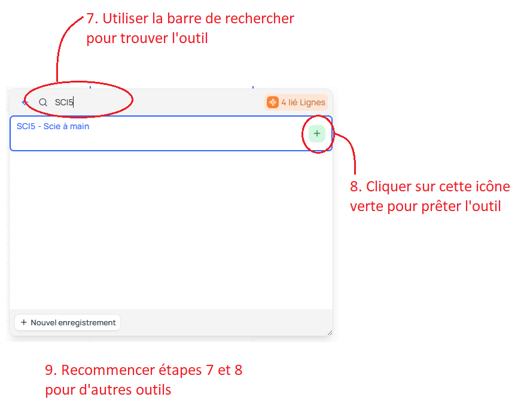

# Prêter des outils à un secteur

## Metode 1: Prêter ou récupérer un outil à la fois
Dans cet exemple, nous allons prêter la perceuse **PV15** au secteur **Déco site - Anthony**.  

1. Cliquer sur la table **Outils** dans le menu de gauche. La liste des outils s'affiche.  
2. Cliquer sur la petite loupe en haut à droite pour ouvrir la barre de recherche.  
      
3. Vous pouvez maintenant chercher l'outil que vous voulez prêter. Par exemple, si vous voulez prêter une perceuse, vous pouvez taper "perceuse" ou "PV" dans la barre de recherche. A partir de là, seuls les outils qui contiennent le mot "perceuse" ou "PV" s'afficheront.  
4. Une fois que vous avez trouvé l'outil que vous voulez prêter (par exemple ici la perceuse PV15), cliquer 1 fois sur la cellule de la colonne **Secteur - Responsable** de l'outil   
      
5. Maintenant que la cellule est sélectionnée, un cadre bleu apparaît autour de la cellule.  Dans l'exemple ci-dessous de la PV15, on voit que la perceuse est actuellement dans le secteur **Déco site - Anthony**. Si la perceuse revient au magasin, cliquer sur . Si vous voulez prêter la perceuse à un autre secteur, cliquer sur   
      
6. Si vous avez cliqué sur , une fenêtre de recherche s'ouvre. Vous pouvez maintenant choisir le secteur à qui vous voulez prêter l'outil.  
      

## Metode 2: Prêter et récupérer plusieurs outils à la fois
Cette méthode est légèrement plus compliquée que la première, mais elle permet de travailler plus vite quand un secteur emprunte ou ramène plusieurs outils en même temps. Dans cet exemple, nous allons prêter la perceuse **PV15** et la scie **SCI1**, et récupérer l'agrapheuse **A1** au secteur **Déco site - Anthony**.  

1. Cliquer sur la table **Secteur - Responsable** dans le menu de gauche. La liste des secteurs s'affiche. Sur cette table, on peut voir le nombre d'outils prêtés à chaque secteur.  
2. Cliquer sur la cellule de la colonne **Outils** du secteur à qui vous voulez prêter ou récupérer des outils. Ici nous cliquons sur la cellule **Outils** du secteur **Déco site - Anthony**.  
      
3. Une fois que la cellule est sélectionnée, un cadre bleu apparaît autour de la cellule. Dans l'exemple ci-dessous du secteur **Déco site - Anthony**, on voit que le secteur a actuellement 5 outils prêtés.  
      
4. Cliquer sur  pour afficher la liste des outils prêtés à ce secteur.  
5. Commençons par récupérer l'agrapheuse **A1**. On voit dans l'image ci-dessous qu'elle apparaît en haut de la liste. Cliquer sur le  de l'agrapheuse pour la récupérer (elle quitte le secteur Déco, et revient au magasin). (Si vous ne voyez pas l'outils que vous cherchez, vous pouvez utiliser la barre de recherche).  
6. Maintenant que l'agrapheuse A1 est récupérée, nous allons prêter la perceuse **PV15** et la scie **SCI1**. Pour cela, cliquer sur **"Lier plus d'enregistrements"** en bas de la liste des outils prêtés.  
      
7. Tout les outils s'affichent. Utiliser la barre de recherche pour trouver les outils que vous voulez prêter. Ici nous cherchons la scie SCI5.  
8. Cliquer sur  de l'outil pour le prêter au secteur.  
9. Répéter les étapes 7 et 8 pour la perceuse PV15.  
      