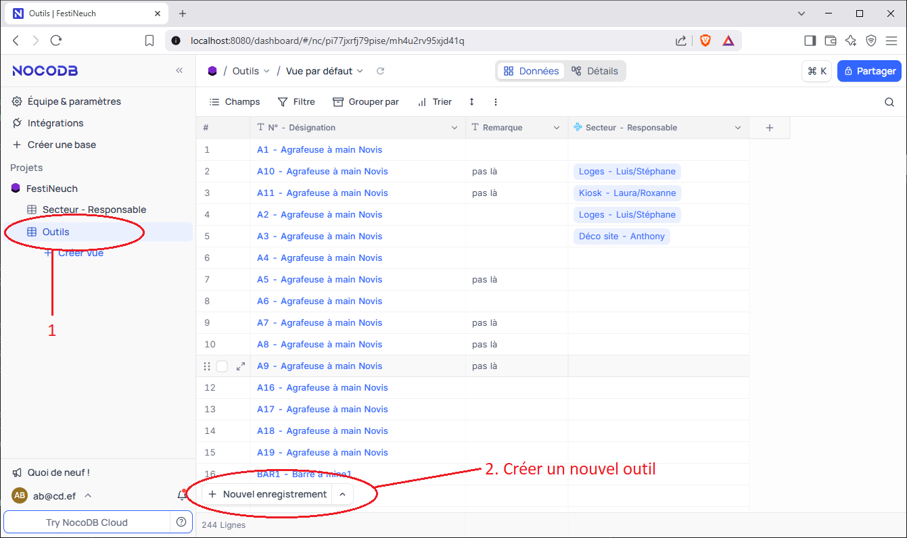
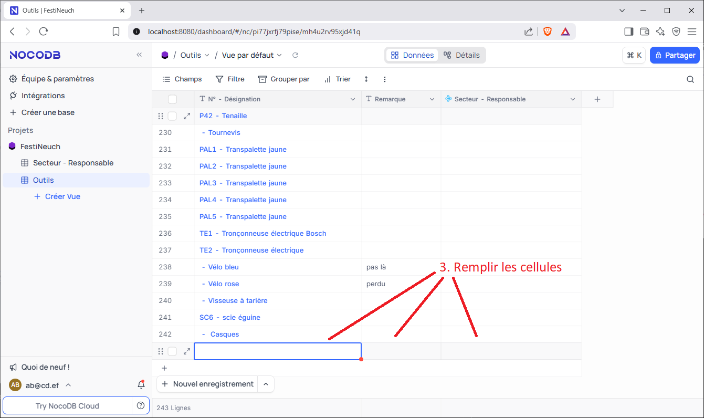
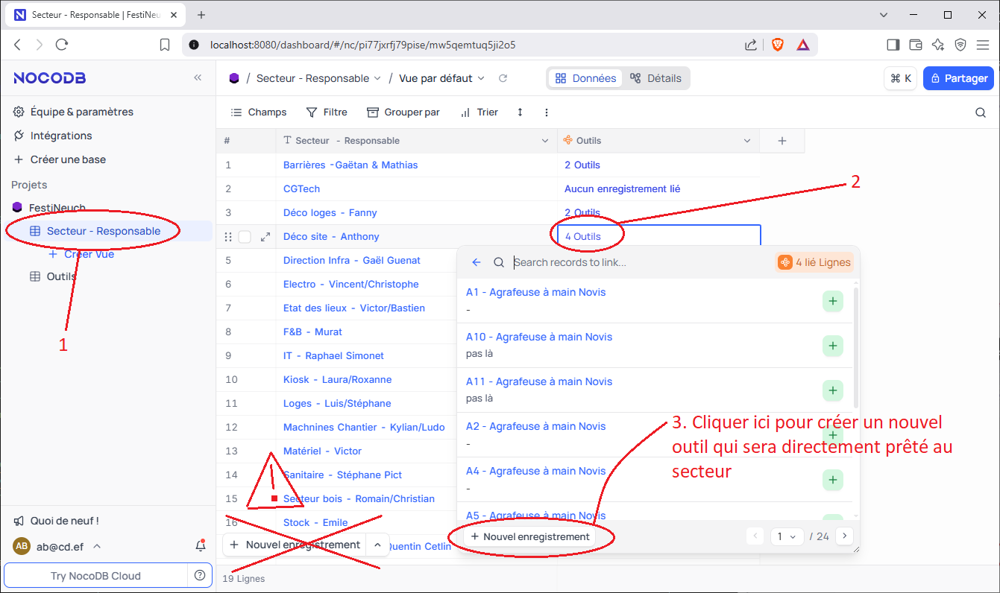
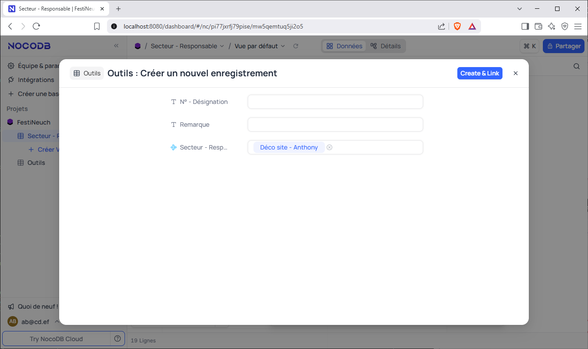

# Créer un nouvel outil

### Methode 1: Créer un nouvel outil depuis la table Outils
1. Ouvrir la table **Outils** dans le menu de gauche.  
2. Cliquer sur le bouton **Ajouter un enregistrement** en bas de la page.  
    
3. Une nouvelle ligne s'affiche en bas de la table. Remplir les informations de l'outil dans cette ligne.
    

### Methode 2: Créer un nouvel outil tout en l'ajoutant à un secteur
Il est possible de créer un nouvel outil depuis la table "**Secteur - Responsable**" tout en l'ajoutant au secteur. Pour cela, il faut déjà connaitre la **methode 2** du chapitre "**Prêter des outils à un secteur**".
1. Ouvrir la table **Secteur - Responsable** dans le menu de gauche.
2. Cliquer sur la cellule de la colonne **Outils** du secteur à qui vous voulez prêter l'outil.
3. Cliquer sur le bouton "**Nouvel enregistrements**" en bas de la fenêtre de recherche des outils. Attention, le même bouton existe aussi en bas de la table des secteurs, mais il ne faut pas l'utiliser ici (il sert a créer un nouveau secteur, pas un nouvel outil).
    
4. Remplir le formulaire qui s'affiche.
    