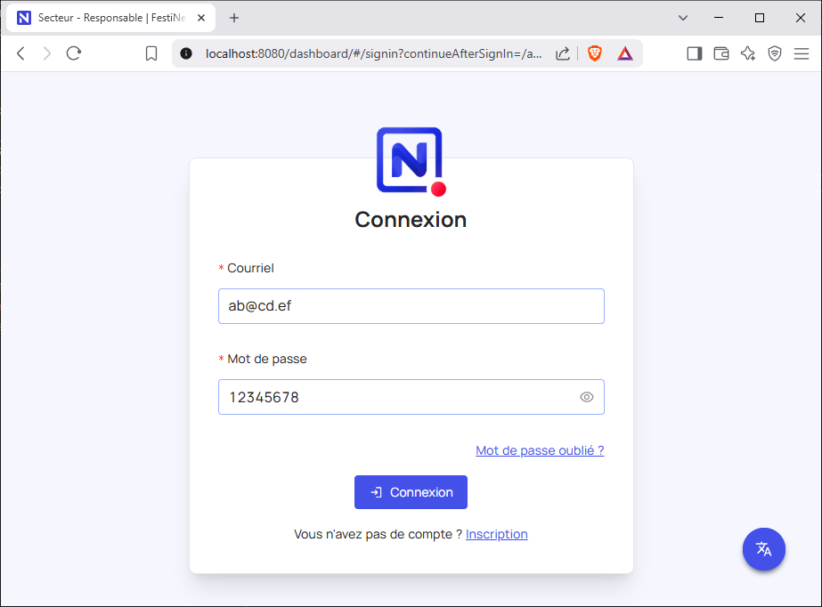

# En cas de problèmes

### Connexion demandée
Parfois il peut-être demandé d'entrer un email et un mot de passe. Si c'est le cas, utiliser l'email `ab@cd.ef` et le mot de passe `12345678`    
  

### Messages d'erreur en bas a droite
Si des messages d'erreur de type `Network Error` apparaissent en bas a droite comme dans l'image ci-dessous, alors le problème vient probablement du fait que le **serveur** est fermé. Pour le réouvrir, suivre les instructions du chapitre **Démarrer** de cette documentation.  
  

### Le menu de gauche à disparu (cas nr 1)
Si le menu de gauche a disparu comme sur l'image ci-dessous, on peut le faire réapparaître en cliquant sur l'icône  en haut à gauche (entouré en rouge dans l'image ci-dessous).  
  
